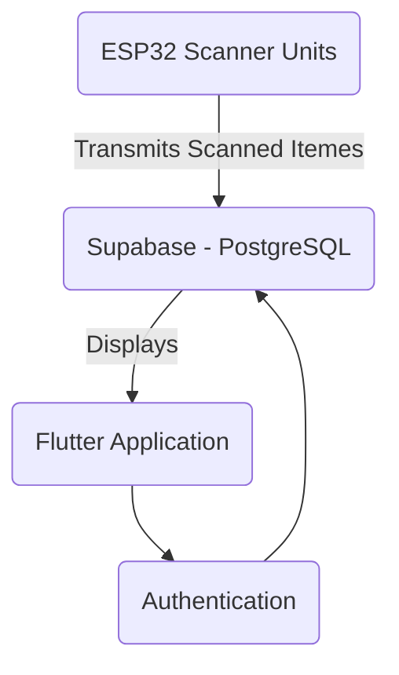
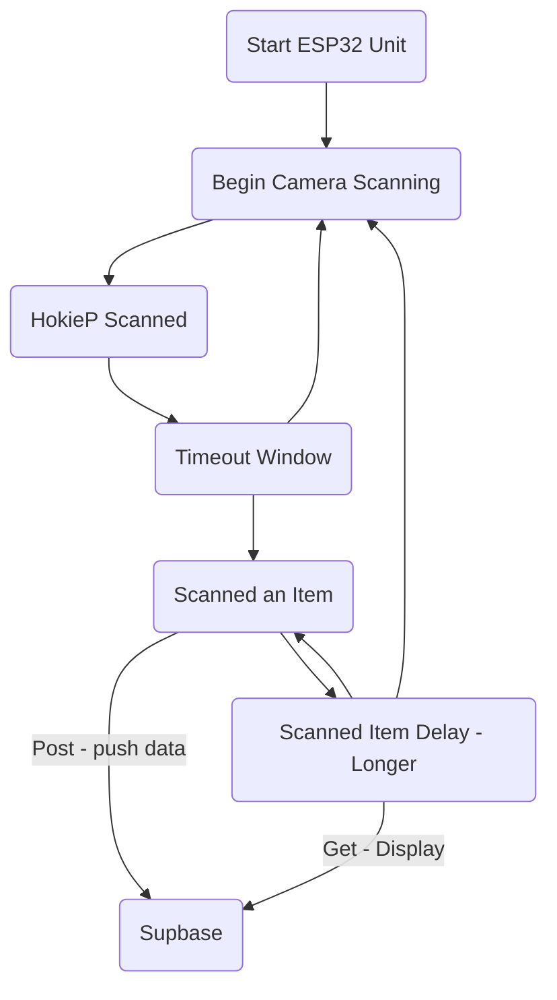

# Group3IncentivesApp

Flutter app to display information like points gathered with the incentives program. Also provides a 'Admin' side which shows the total flow and statistics for the University. 

## Project Overview

Create an incentive system to throw waste into correct bins, and track what waste actually goes back into the system. Relies on QR codes and barcoes.

Accomplished using scanner units (built with esp32s), and a mobile application for data display. The mobile app tracks points and items thrown away (Flutter)

## Technology

Supabase, Flutter
ESP32, C++, HTTP

## Repo Contents

C++ with ESP32 that connects to Wi-Fi and sends posts to Supabase.

Scans QR codes with an attached camera.

Also responsible for displaying to an 16x2 LCD screen information upon scan. 

# Overall Software Design

# Scanner Unit Process

# ERD

